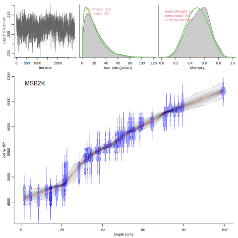
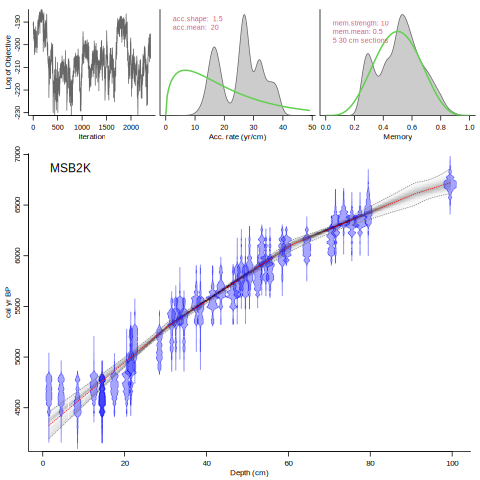
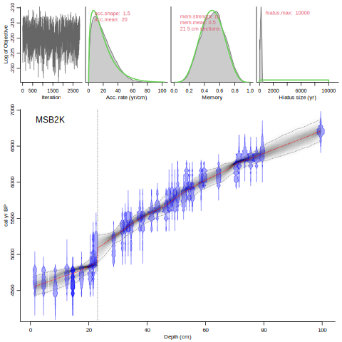
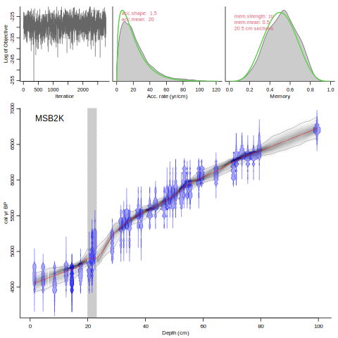
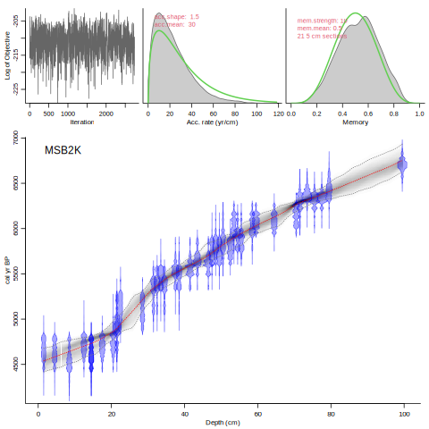
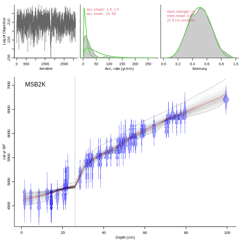
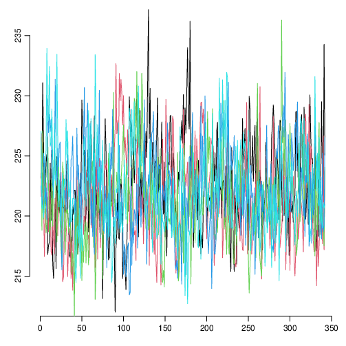
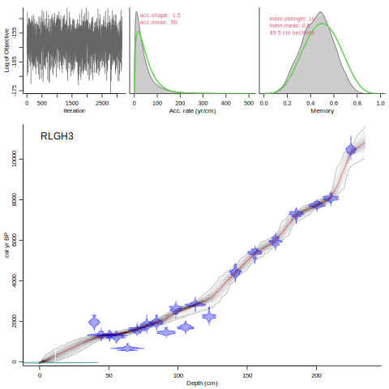
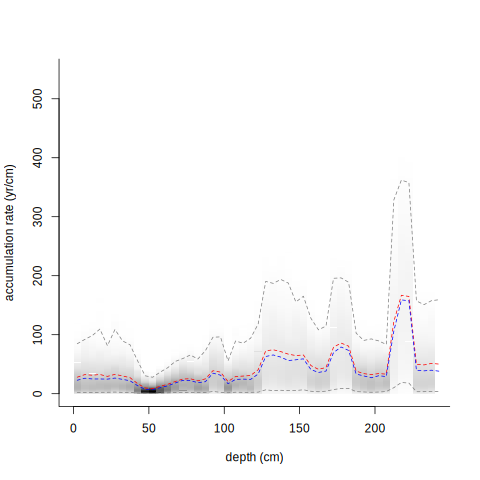
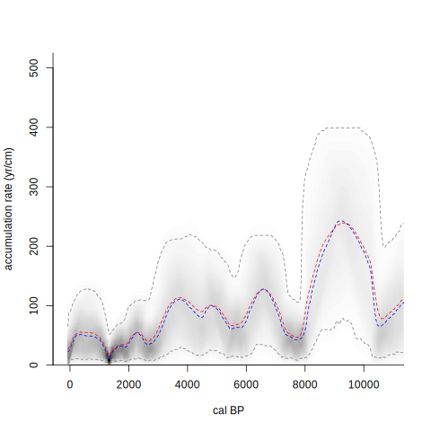

This page contains the R code that will be ran in the second session of the GSA Short Course on age-modeling - part 2b on the practicalities of running rbacon.

The presentation slides of this session can be downloaded from these links: [.odp](./2b_agemodels_practical.odp) or [.pptx](./2b_agemodels_practical.pptx).

The first slides which we could reproduce here were done using the R package `clam`. Assuming you have it installed already (see [here](intro.html)), then you simply need to load the code:

```{r}
require(clam)
```

The basic, default model is linear interpolation through the dated levels of the standard core that comes with clam:

```{r, fig.width=5, fig.asp=1}
clam()
```

Or, for example, a smooth spline (4):

```{r, fig.width=5, fig.asp=1}
clam(, 4)
```

Or assume that a hiatus happened at 470 cm core depth, causing a gap in time:

```{r, fig.width=5, fig.asp=1}
clam(, 4, hiatus=470)
```

and there was a thick tephra at 280-270 cm depth:
```{r, fig.width=5, fig.asp=1}
clam(, 4, hiatus=470, slump=c(280, 270))
```

To see all clam’s options, type:
```{r, eval=FALSE}
?clam
```

If you want/need to have your files in a different folder, e.g. a USB stick:
```{r, eval=FALSE}
clam(, coredir="E:/")
```

These commands are helpful to query and set the working directory:

```{r, eval=FALSE}
getwd()
setwd("E:")
```

## Bacon

Now we move on to Bacon. If you haven't installed it yet (or if an updated version might be available for download), do that now:

```{r, eval=FALSE}
install.packages('rbacon')
```

Then load the code:

```{r}
require(rbacon)
```

Now run the example core, using default settings (type `y` or press Enter to accept the defaults):

```{r, eval=FALSE}
Bacon()
```



Let's run Bacon with thicker, fewer sections (30 cm instead of the 5 cm default; not a good idea, but anyway, in this case do NOT accept the suggested alternative section thickness):

```{r, eval=FALSE}
Bacon(, 30)
```


Note that bad mixing of the MCMC run in the upper left panel. We should run this for longer (using more MCMC iterations, using the `ssize` parameter), or find different settings that work better.

We could also impose a hiatus at 23 cm depth:

```{r, eval=FALSE}
Bacon(, hiatus.depth=23)
```


Or, imagine that there was a thick tephra layer at 23-20 cm depth:

```{r, eval=FALSE}
Bacon(, slump=c(23,20))
```



It is also important to play around with the settings for the prior information - not least to see how robust your age-depth model is to different parameter settings:

```{r, eval=FALSE}
Bacon(, acc.mean=30)
```



Or set a boundary, and a different prior for accumulation rate below it than the one above it:

```{r, eval=FALSE}
Bacon(, boundary=26, acc.mean=c(10, 50))
```




To check if there are any problems with the MCMC run, you can also run your core a few times and compare the MCMC variability between the runs. For example, run the default core 5 times using very few iterations each time:

```{r, eval=FALSE}
Baconvergence("MSB2K", 5, ssize=100)
```

```
Did 5 Bacon runs.
Gelman and Rubin Reduction Factor 1.11150186669561 (smaller and closer to 1 is better).
Probably not a robust MCMC run! Too much difference between runs, above the 1.05 threshold. Increase sample size?
```


The used `ssize` of just 100 iterations is clearly too small for reliable, stable MCMC runs. In the end you'd want around 3,000+ stored iterations and a stable run, which looks like 'white noise' without features such as local optima and long horizontal stretches.

If you have a very long MCMC output and want to thin or cut it to reach a more manageable size, check out the functions `scissors()` and `thinner()`.

RLGH3 is another core that comes with Bacon. It has fewer dates than MSB2K, and some of them seem to disagree with the others. Accept the suggestions by pressing `y` and Enter:

```{r, eval=FALSE}
Bacon("RLGH3")
```



By default, age estimates are calculated for every cm from the top to the bottom core depth. The interval, `d.by`, can be adapted, and alternatively `depths` can be provided as a variable, or a file with depths read in (the file should live in the core's folder, start with the core's name and end in `_depths.txt`).

```{r, eval=FALSE}
Bacon(d.by=2)
my.depths <- seq(0, 100, by=3)
Bacon(depths=my.depths)
Bacon(depths.file=TRUE)
```


To see all Bacon’s options, type:
```{r, eval=FALSE}
?Bacon
```


### Post-run analyses

You can load a previous, existing run without having to run it again (assuming here that minimum and maximum core depths haven't changed). First load it and then draw the age-model plot to get all the data in memory:

```{r, eval=FALSE}
Bacon("RLGH3", run=FALSE)
agedepth()
```


Plot accumulation rates against depth (first setting the layout back to one plot per panel):

```{r, eval=FALSE}
layout(1)
accrate.depth.ghost()
```



or against age:

```{r, eval=FALSE}
accrate.age.ghost()
```




---

Additional Bacon tutorials are available here: <br>
<ul>
  <li><a href="https://cran.r-project.org/web/packages/rbacon/vignettes/intro.html">Getting started with rbacon</a>
  <li><a href="https://cran.r-project.org/web/packages/rbacon/vignettes/priorssettings.html">Piors and other settings</a>
  <li><a href="https://cran.r-project.org/web/packages/rbacon/vignettes/foldersfiles.html">Locations of Bacon folders and files</a>
  <li><a href="https://cran.r-project.org/web/packages/rbacon/vignettes/postrun.html">Post-run analysis</a>
  <li><a href="https://cran.r-project.org/web/packages/rbacon/vignettes/FAQ.html">Frequently Asked Questions</a>

---

[prev: session 2a](session_2a.html)<br>
[next: session 3](session_3.html)
