This page contains the R code that will be ran in the third and final session of the GSA Short Course on age-modeling - part 3 on running Bacon, Plum and your own cores.

<!--The presentation slides of this session can be downloaded from these links: [.odp](./3_BaconPlum.odp) or [.pptx](./3_BaconPlum.pptx). -->

The first slides which we could reproduce here were done using the R package `rbacon`. Assuming you have it installed already (see [here](intro.html)), then you simply need to load the code:

```{r}
require(rbacon)
```

First we run the default core, using all default settings, in order to look at the prior (green) and posterior (grey) of the accumulation rates:

```{r, eval=FALSE}
Bacon()
```
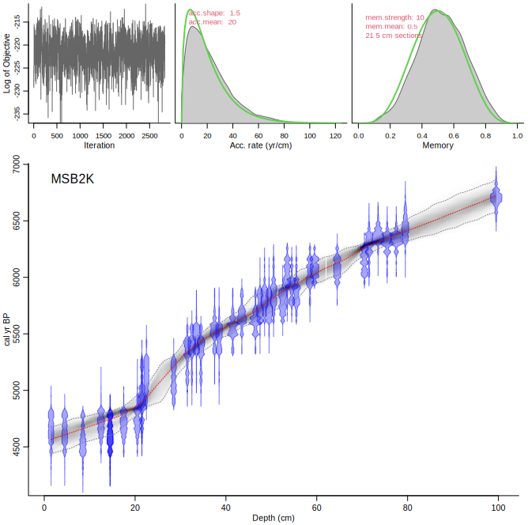

Compare the upper panels with those of the following run, NOT accepting the suggested change in accumulation rate prior (so keeping it at the default of 20 yr/cm):

```{r, eval=FALSE}
Bacon("RLGH3", suggest=FALSE)
```
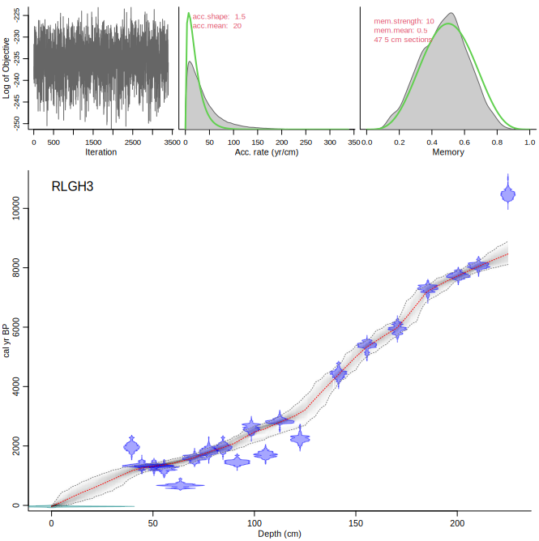

Now we run the above core again, but accepting the suggested change in acc.rate prior:

```{r, eval=FALSE}
Bacon("RLGH3", accept.suggestions=TRUE)
```
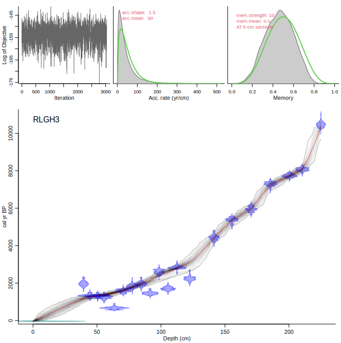

You can also set different acc.rate priors below and above specific core depths, e.g. at 140 cm depth, with a prior of 200 yr/cm below it and 5 yr/cm above it:

```{r, eval=FALSE}
Bacon("RLGH3", boundary=140, acc.mean=c(5, 200))
```
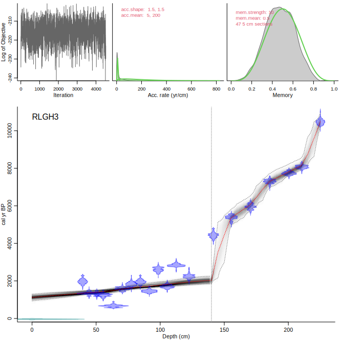

Or model a hiatus instead of a boundary (which is a 0-yr hiatus):

```{r, eval=FALSE}
Bacon("RLGH3", hiatus.depths=140, acc.mean=c(5, 200))
```
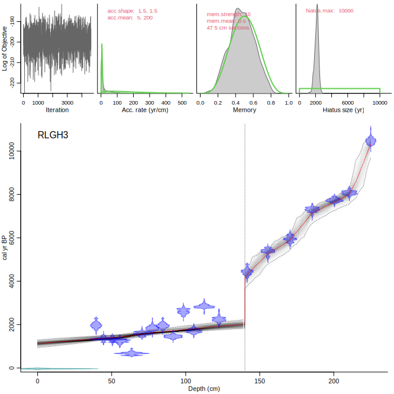

---

Now we move on to the MCMC panel. Let's do a bad run, with far too few sections, and which will hopefully result in an awful MCMC process:

```{r, eval=FALSE}
Bacon(Bacon, 30)
```
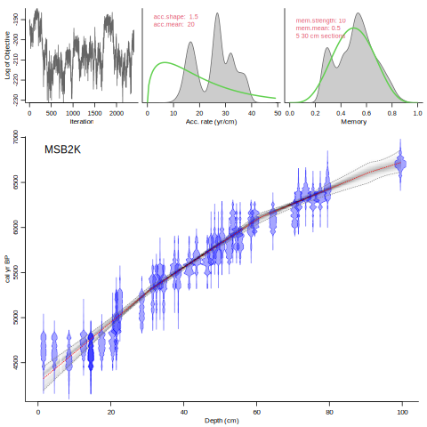

Note that the upper-left panel does not show a nice 'white-noise' structure. Instead there is lots of correlation between the iterations, so they are not independent and likely not a good approximation of the true distribution of the accumulation rate parameters.

If you encounter such difficult runs, it is probably a good idea to check for the robustness of the MCMC runs of your core with the applied settings. You can use `Baconvergence` for this (here we run MSB2K, 5 times, using a very small sample size of only 100):

```{r, eval=FALSE}
Baconvergence("MSB2K", 5, ssize=100)
```
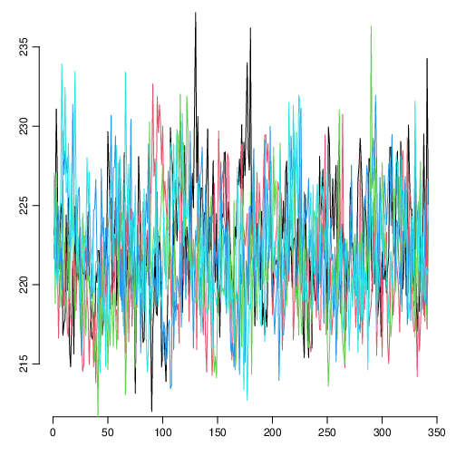

---

Let's run some other cores. Amy kindly provided us with two cores, which I ran using the default settings:

```{r, eval=FALSE}
Bacon("Swiftcurrent41223")
```
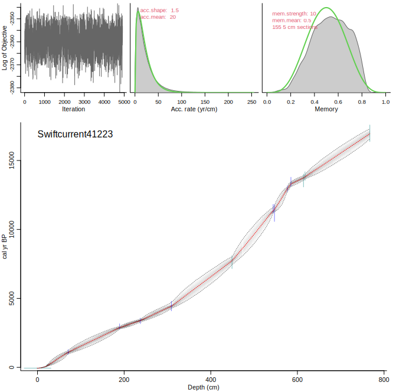

And also `Steel98`:

```{r, eval=FALSE}
Bacon("Steel98")
```
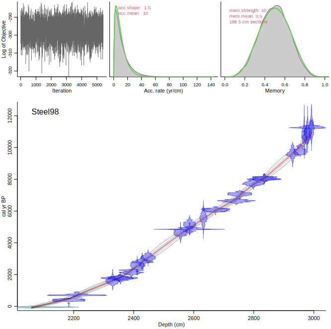


---

Additional Bacon tutorials are available here: <br>
<ul>
  <li><a href="https://cran.r-project.org/web/packages/rbacon/vignettes/intro.html">Getting started with rbacon</a>
  <li><a href="https://cran.r-project.org/web/packages/rbacon/vignettes/priorssettings.html">Priors and other settings</a>
  <li><a href="https://cran.r-project.org/web/packages/rbacon/vignettes/foldersfiles.html">Locations of Bacon folders and files</a>
  <li><a href="https://cran.r-project.org/web/packages/rbacon/vignettes/postrun.html">Post-run analysis</a>
  <li><a href="https://cran.r-project.org/web/packages/rbacon/vignettes/FAQ.html">Frequently Asked Questions</a>
</ul>
You should also be able access the above by typing `browseVignettes('rbacon')`.

---

Now we move on to Plum, for Pb-210 age-depth modelling. Again we assume you have it installed already (see [here](intro.html)), so we simply load it:

```{r}
require(rplum)
```

Now we run the default core. This takes a while to run, so we might not run the core during the session. rplum runs tend to take longer than rbacon runs, because generally more parameters have to be estimated, not least because the default section thickness for rplum is `1` cm, not rbacon's `5` (why would you think we made that choice?).

Let's run the default core (accepting all defaults):

```{r, eval=FALSE}
Plum()
```
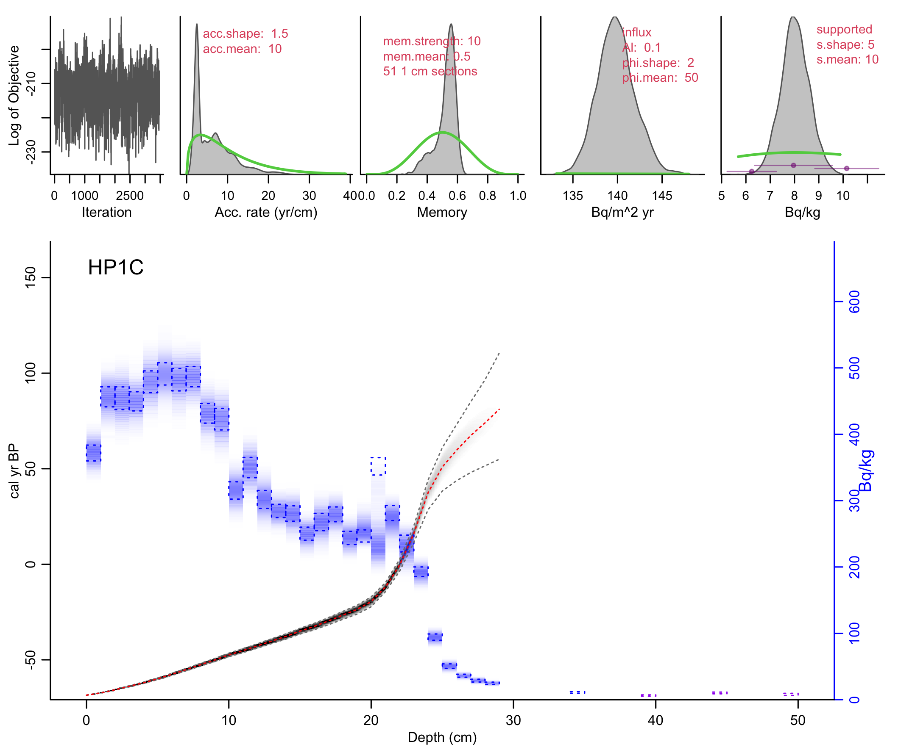{width=70%}

As with rbacon, we have top panels (but more), and the main panel. All panels are useful and should be presented in papers! The first three are as in rbacon, and then there are two more for the Pb influx and the supported Pb. The main panel also has a difference with rbacon in that it shows the Pb measurements (blue squares) and their modeled values (bluescale).

If your core also has radium data to estimate supported Pb, you can run the core either assuming that the radium values are constant throughout the core (`ra.case 1`;  this requires fewer parameters and thus runs faster):

```{r, eval=FALSE}
Plum(“LL14”, ra.case=1)
```
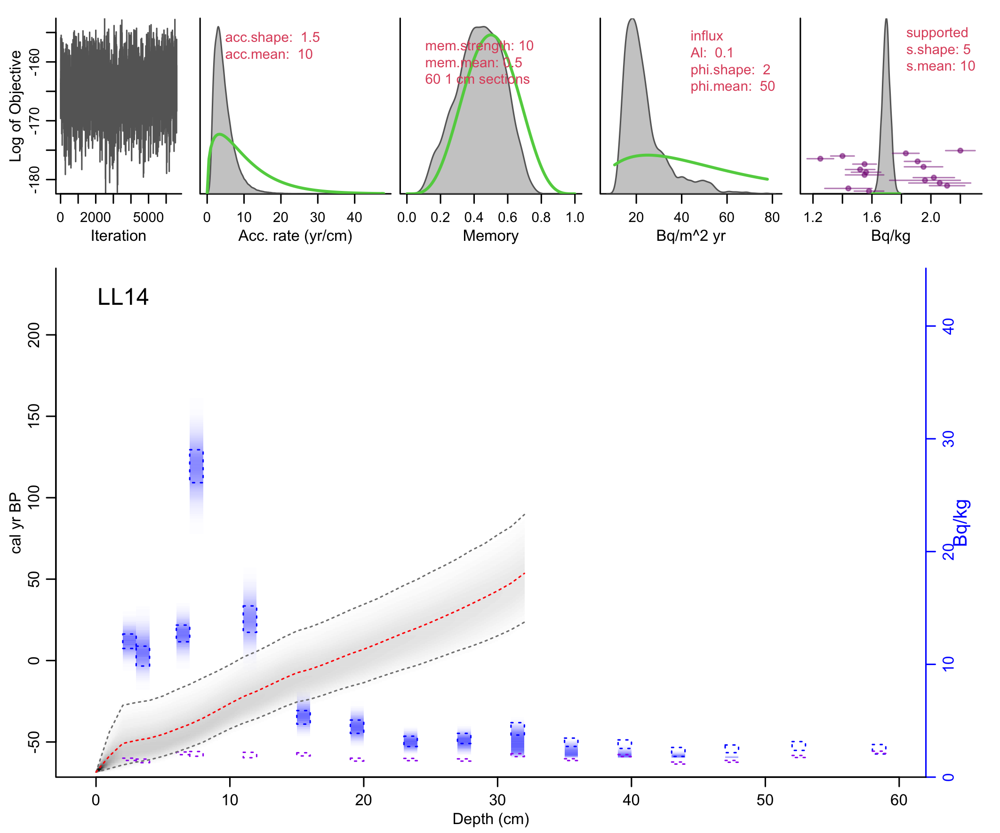{width=70%}

Or assume that the values fluctuate throughout the core (takes longer to run):

```{r, eval=FALSE}
Plum(“LL14”, ra.case=2)
```
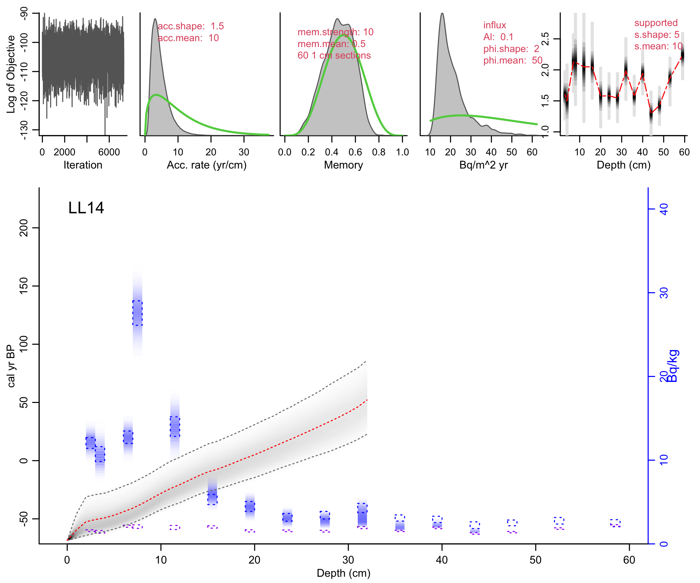{width=70%}

If you have additional dating information such as historical markers or radiocarbon dates, these can be added as well (using the data format of rbacon's .csv files):

```{r, eval=FALSE}
Plum(“LL14”, ra.case=1, otherdates=”LL14_14C.csv”)
```
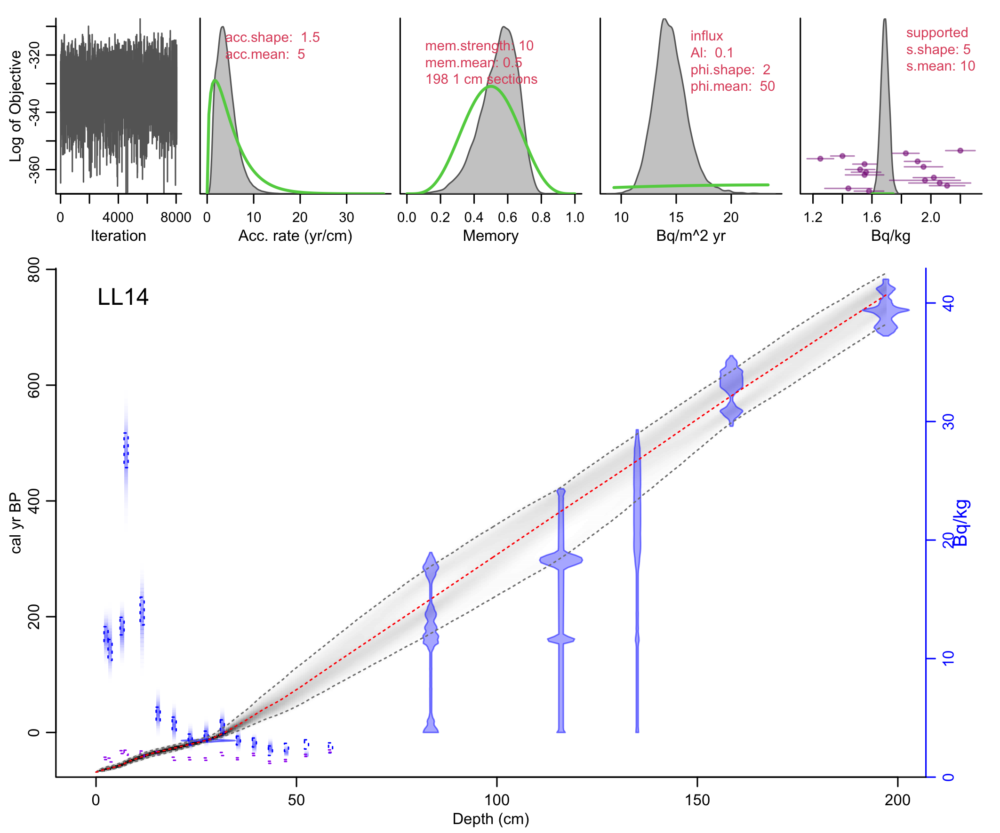{width=70%}


[prev: session 2b](session_2b.html)<br>
